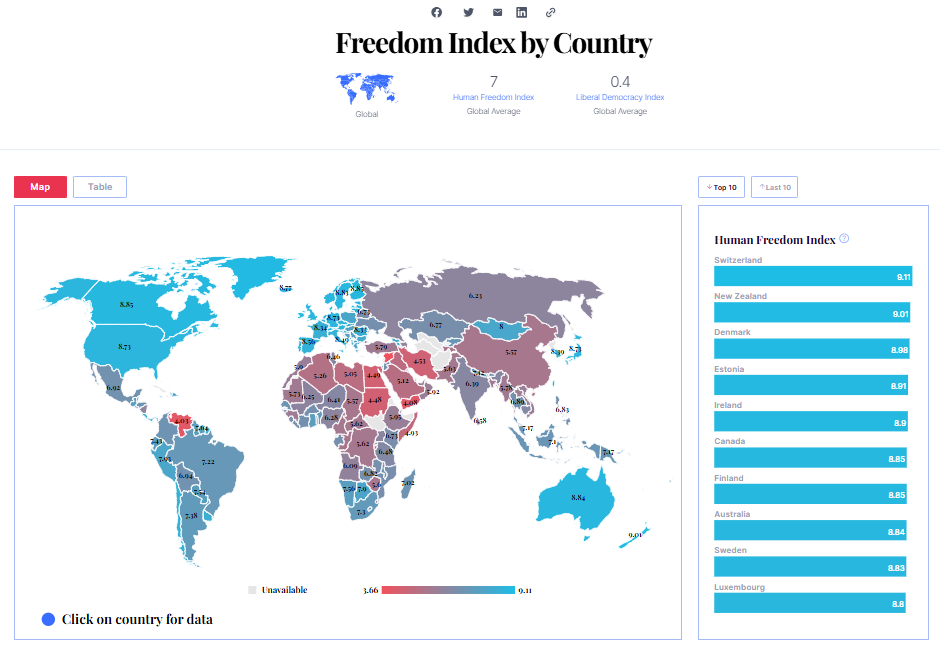
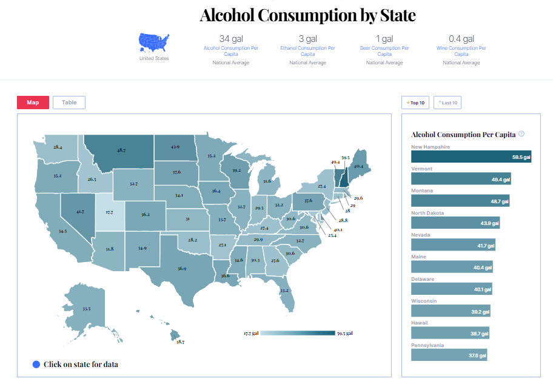

# 🗺️ Maps & Vis  

This repository showcases **interactive visualizations and map back-end development** created with **JavaScript + D3.js**, using **MySQL** as the database and integrated into **WordPress**. Some of the visualizations were created for [Wisevoter.com](https://wisevoter.com/).

I **contributed to the development of these maps** by managing data pipelines, preparing the datasets, and supporting the back-end integration that powers the visualizations.  

The repo highlights:  
- 🌍 World maps (choropleth and indicators)  
- 🇺🇸 U.S. maps (state & county level)  
 
---

## 🌍 World Maps  

**Preview:**  

  

  

---

## 🇺🇸 U.S. Maps  

**Preview:**  

  

  

---

## 🛠️ Tech Stack  

  
  
  
  

---

## ⚡ Notes  
- Visualizations are shown for portfolio purposes (anonymized where required).  
- My contribution focused on **data administration, preparation, and back-end support** for powering these visualizations.  
